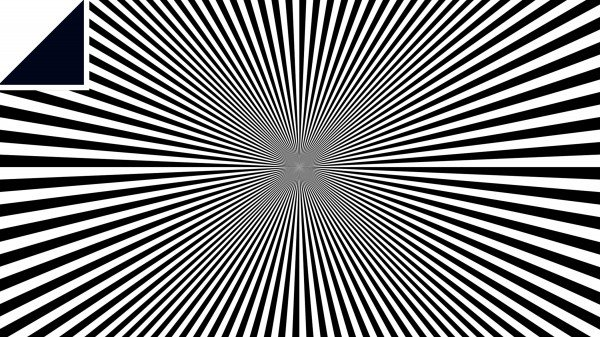

# 神经网络：什么是视觉幻象？我不懂(Neural networks don't understand what optical illusions are)

This original blog is from https://www.technologyreview.com/s/612261/neural-networks-dont-understand-what-optical-illusions-are/amp/.

本文翻自https://www.technologyreview.com/s/612261/neural-networks-dont-understand-what-optical-illusions-are/amp/。

Machine-vision systems can match humans at recognizing faces and can even create realistic synthetic faces. But researchers have discovered that the same systems cannot recognize optical illusions, which means they also can’t create new ones.

机器视觉系统可以在面部识别方面和人类媲美，并且甚至可以自己合成人脸。
但是研究者已经发现，这样的系统无法辨别视觉幻想，也就意味着，它们也无法生成新的幻象图。

Human vision is an extraordinary facility. Although it evolved in specific environments over many millions of years, it is capable of tasks that early visual systems never experienced. Reading is a good example, as is identifying artificial objects such as cars, planes, road signs, and so on.

人类视觉是一种非凡的能力。尽管在特定的环境中不断进化了数百万年，但是它可以完成早些视觉系统根本无法经历过的任务。
阅读就是一个很好的例子，同时还有辨识人造的物体，例如汽车、飞机、道路标识等等。

But the visual system also has a well-known set of shortcomings that we experience as optical illusions. Indeed, researchers have identified many ways in which these illusions cause humans to misjudge color, size, alignment, and movement.

但是视觉系统也存在广为人知的缺陷，也就是我们会被视觉欺骗。
事实上，研究者们已经找到了很多方式，可以让人类被幻觉欺骗而导致对颜色、大小、线和移动的判断失误。

The illusions themselves are interesting because they provide insight into the nature of the visual system and perception. So ways of finding new illusions that explore these limits would be hugely useful.

幻觉本身就很有意思，因为它们让我们可以进一步理解视觉系统和感官的本质。
所以发现新的突破现有局限的幻象就显得意义重大。

Which is where deep learning comes in. In recent years, machines have learned to recognize objects and faces in images and then to create similar images themselves. So it’s easy to imagine that a machine-vision system ought to be able to learn to recognize illusions and then to create its own.

深度学习将何去何从？在近些年，机器已经学会识别图像中的物体和面部并且可以去自行创造相似的图像。
所以很容易想象机器视觉系统应该也能够学着识别和创造幻象。

Enter Robert Williams and Roman Yampolskiy at the University of Louisville in Kentucky. These guys have attempted this feat but found that things aren’t so simple. Current machine-learning systems cannot generate their own optical illusions—at least not yet. Why not?

这些人尝试着去突破，但是发现事情并不简单。当前的机器学习系统无法（至少现在还不能）生成它们自己的视觉幻象。那么究竟是为什么呢？

First some background. The recent advances in deep learning are based on two advances. The first is the availability of powerful neural networks and one or two programming tricks that make them good at learning.

首先来了解一下背景。当前深度学习的不断进步的动力实际上基于以下两个方面。第一是越来越容易搭建强大的神经网络以及总有一些让它们擅于“学习”的编程技巧。

The second is the creation of huge annotated databases that machines can learn from. Teaching a machine to recognize faces, for example, requires many tens of thousands of images containing faces that are clearly labeled. With that information, a neural net can learn to spot characteristic facial patterns—two eyes, a nose, and a mouth, for example. And even more impressive, a pair of them—called a generative adversarial network—can teach each other to create realistic, but totally synthetic, images of faces.

第二点是大量可供机器学习的庞大的数据库。例如，训练机器进行面部识别需要数以万计的包含明确标签的面部图片。
有了标签，神经网络可以学习标记面部的特征部位——一双眼睛，一个鼻子和一个嘴巴。
并且更厉害的是，一对神经网络（被称为生成对抗网络）可以互相训练对方生成真实但是人造的面部图像。

Williams and Yampolskiy set out to teach a neural network to identify optical illusions in the same way. The computing horsepower is easily available, but the necessary databases are not. So the researchers’ first task was to create a database of optical illusions for training.

同样的，Williams和Yampolskiy着手训练神经网络识别光学错觉。
计算资源很容易获得，但是必要的数据库却不同了。
所以研究者们的第一个任务就是建造用于训练的光学错觉数据库。

That turns out to be hard. “The number of static optical illusion images is in the low thousands, and the number of unique kinds of illusions is certainly very low, perhaps only a few dozen,” they say.

但他们发现这是很难的：“光学错觉的图像只有区区几千，并且真正独一无二的图像更加的少，大概只有几十个。

That represents a challenge for current machine-learning systems. “Creating a model capable of learning from such a small and limited dataset would represent a huge leap in generative models and understanding of human vision,” they say.

So Williams and Yampolskiy compiled a database of over 6,000 images of optical illusions and then trained a neural network to recognize them. Then they built a generative adversarial network to create optical illusions for itself.

The results were disappointing. “Nothing of value was created after 7 hours of training on an Nvidia Tesla K80,” say the researchers, who have made their database available for others to use.

Nevertheless, this is an interesting result. “The only optical illusions known to humans have been created by evolution (for instance, eye patterns in butterfly wings) or by human artists,” they point out.

In both cases, humans play a crucial role by providing valuable feedback—humans can see the illusion.

But machine-vision systems cannot. “It seems unlikely that [a generative adversarial network] could learn to trick human vision without being able to understand the principles behind these illusions,” say Williams and Yampolskiy.

They may not be easy, because there are crucial differences between machine-vision systems and the human visual system. Various researchers are developing neural networks that resemble the human visual system ever more closely. Perhaps an interesting test will be whether they can see illusions or not.

In the meantime, Williams and Yampolskiy are not optimistic. “It seems that a dataset of illusion images might not be sufficient to create new illusions,” they say. So for the moment, optical illusions are a bastion of human experience that machines cannot conquer.

