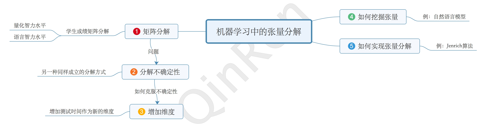
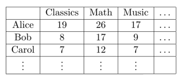
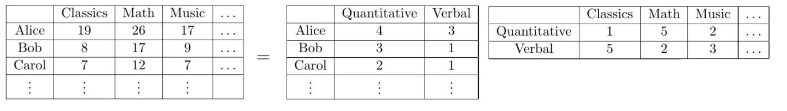
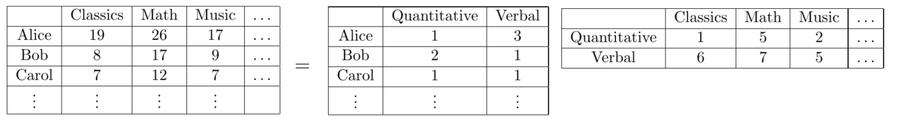
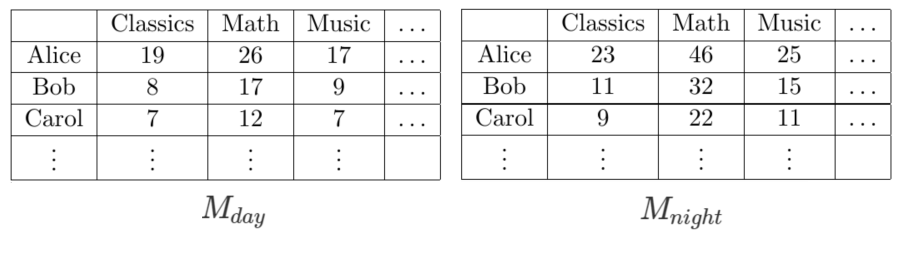
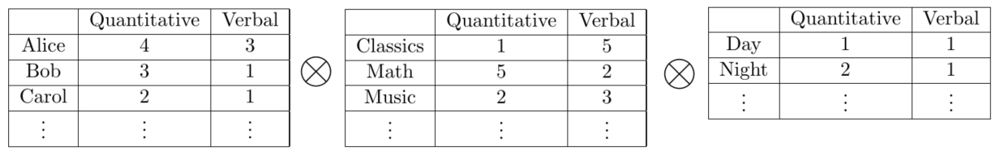
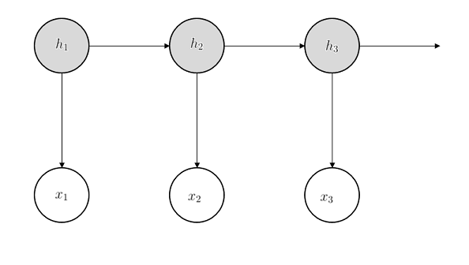

# 机器学习中的张量方法(Tensor Methods in Machine Learning)

This original blog is from https://www.offconvex.org/2015/12/17/tensor-decompositions/.

本文翻自https://www.offconvex.org/2015/12/17/tensor-decompositions/。

翻译： 张亚东

- [矩阵分解 （Matrix Decompositions）](#1-matrix-decompositions)
- [分解的不确定性 （The Ambiguity）](#2-the-ambiguity)
- [增加第三个维度（Adding the 3rd Dimension）](#3-adding-the-3rd-dimension)
- [挖掘张量（Finding the Tensor）](#4-finding-the-tensor)
- [张量分解的实现（Implementing Tensor Decomposition）](#5-implementing-tensor-decomposition)

Tensors are high dimensional generalizations of matrices.
In recent years tensor decompositions were used to design learning algorithms for estimating parameters of latent variable models like Hidden Markov Model, Mixture of Gaussians and Latent Dirichlet Allocation (many of these works were considered as examples of “spectral learning”, read on to find out why). 
In this post I will briefly describe why tensors are useful in these settings.

张量是矩阵的高维推广。在近些年，张量分解被广泛应用于为那些具有潜在变量的模型设计学习算法，例如隐藏马尔科夫模型（HMM）、高斯和隐藏Dirichlet分配的混合方法。通常，这些方法都被认为是谱学习的实例。
在这篇文章中，我将会简单介绍为何张量在这些领域如此神通广大。

Using Singular Value Decomposition (SVD), we can write a matrix M∈Rn×m as the sum of many rank one matrices:

通过奇异值分解方法（SVD），我们可以把一个矩阵   记作多个秩为1的矩阵和的形式：

When the rank r is small, this gives a concise representation for the matrix M (using (m+n)r parameters instead of mn). Such decompositions are widely applied in machine learning.

如果比较小，那么就可以给出对矩阵的简洁表达形式（使用了个参数，而不是个）。这样的分解在机器学习中有着广泛应用。

Tensor decomposition is a generalization of low rank matrix decomposition. Although most tensor problems are NP-hard in the worst case, several natural subcases of tensor decomposition can be solved in polynomial time. Later we will see that these subcases are still very powerful in learning latent variable models.

张量分解是低秩矩阵分解的推广。尽管大多数张量问题在最坏的情况下都是NP难问题，但是很多张量分解的子问题可以在多项式级别复杂度的时间内解决。后面我们会看到，这些子问题在学习潜在变量模型中仍旧十分强大。

## 1. 矩阵分解 （Matrix Decompositions）

Before talking about tensors, let us first see an example of how matrix factorization can be used to learn latent variable models. In 1904, psychologist Charles Spearman tried to understand whether human intelligence is a composite of different types of measureable intelligence. Let’s describe a highly simplified version of his method, where the hypothesis is that there are exactly two kinds of intelligence: quantitative and verbal. Spearman’s method consisted of making his subjects take several different kinds of tests. Let’s name these tests Classics, Math, Music, etc. The subjects scores can be represented by a matrix M, which has one row per student, and one column per test.

在讲张量之前，让我们先看一个例子关于如何将矩阵分解应用于学习隐藏变量。
在1940年，心理学家Charles Spearman尝试理解人类的智力是否可以分解为多种可测量的智力种类。我们来介绍一个对Charles Spearman方法的一个高度简化的版本——假设人类的智力由两个部分组成，量化和语言。
Charles Spearman通过进行各种不同类型的考试来组成他的科目，其中包括：文学，数学，音乐等等。这些课程的分数用矩阵M来表示，其中，每一行代表一个学生，每一列代表一种科目。

The simplified version of Spearman’s hypothesis is that each student has different amounts of quantitative and verbal intelligence, say xquant and xverb respectively. Each test measures a different mix of intelligences, so say it gives a weighting yquant to quantitative and yverb to verbal. Intuitively, a student with higher strength on verbal intelligence should perform better on a test that has a high weight on verbal intelligence. Let’s describe this relationship as a simple bilinear function:

Charles Spearman的假设的简化版：每一个学生具有不同的量化智力水平和语言智力水平，各自用和 符号代表。
同时，每一种科目的测试衡量了不同程度智力水平的组合，（例如数学科目当中衡量量化智力水平的程度要更高一些），所以给量化水平和语言水平不同的权重，分别用和 代表。
直观得说，一个学生如果拥有较高的语言水平（相对于量化水平），那么他/她应该可以在语言水平权重比较高的科目中获得更优异的成绩。（例如语言水平更高的同学的语文成绩应该要比数学成绩更高一些）。
那么我们用一个简单的二维线性函数来描述这个现象：

Denoting by x verb,x quant the vectors describing the strengths of the students, and letting y verb,y quant be the vectors that describe the weighting of intelligences in the different tests, we can express matrix M as the sum of two rank 1 matrices (in other words, M has rank at most 2):

用和 向量表示学生样本的两种智力水平，用和表示在不同考试当中两个智力类型的权重，我们可以用两个秩为1的矩阵和表示M，（而M的秩最大为2）：

Thus verifying that M has rank 2 (or that it is very close to a rank 2 matrix) should let us conclude that there are indeed two kinds of intelligence.

因此，确认的矩阵的秩为2（或者说是很接近秩为2的矩阵，这里指的是矩阵在科目方向上的秩很接近2）可以让我们推断出确实只有这两种智力水平。

Note that this decomposition is not the Singular Value Decomposition (SVD). SVD requires strong orthogonality constraints (which translates to “different intelligences are completely uncorrelated”) that are not plausible in this setting.

需要说明的是，这里的分解并不是奇异值分解（SVD），SVD具有很强的正交性约束条件，换句话说就是不同的智力类型是完全不相关的，而在这个问题中正交约束并不合理。

## 2. 分解的不确定性 （The Ambiguity）

But ideally one would like to take the above idea further: we would like to assign a definitive quantitative/verbal intelligence score to each student. This seems simple at first sight: just read off the score from the decomposition. For instance, it shows Alice is strongest in quantitative intelligence.

很自然地，大家会将上一节讲到的思路进一步拓展，我们希望给每一个学生赋予确定的量化/语言智力水平。
这似乎乍一看很简单：只要从分解的矩阵中取出分数即可。例如，上面的分析表明，Alice的量化智力水平最高。

However, this is incorrect, because the decomposition is not unique! The following is another valid decomposition.

然而，这是不正确的，因为分解并不是唯一确定的，下面是另一种同样成立的分解方式：

According to this decomposition, Bob is strongest in quantitative intelligence, not Alice. Both decompositions explain the data perfectly and we cannot decide a priori which is correct.

在新的分解方式中，Bob的量化智力水平最高，而不是Alice。两种分解都很好的与实际数据吻合，所以我们根本无法确定哪一个才是正确的。

Sometimes we can hope to find the unique solution by imposing additional constraints on the decomposition, such as all matrix entries have to be nonnegative. However even after imposing many natural constraints, in general the issue of multiple decompositions will remain.

通常，我们希望通过在分解过程中附加约束找到唯一的解，例如所有矩阵元素必须是非负的。然而，尽管利用了许多正常的约束，通常多解的问题依旧存在。

## 3. 增加第三个维度（Adding the 3rd Dimension）

Since our current data has multiple explanatory decompositions, we need more data to learn exactly which explanation is the truth. Assume the strength of the intelligence changes with time: we get better at quantitative tasks at night. Now we can let the (poor) students take the tests twice: once during the day and once at night. The results we get can be represented by two matrices Mday and Mnight. But we can also think of this as a three dimensional array of numbers -– a tensor T in R♯students×♯tests×2. Here the third axis stands for “day” or “night”. We say the two matrices Mday and Mnight are slices of the tensor T.

在第二节我们讲到了，因为目前的数据有多种分解方式，所以我们需要更多的数据去挖掘到底怎样的分解才是正确的。
假设智力水平会随着一天内的时间发生改变，例如，我们在晚上的时候可以更好的完成量化类型的工作（只是一个假设）。
现在让学生进行两次考试，一次是在白天，一次在晚上。得到的结果将会用两个矩阵表示，和。
但是我们可以认为这是一个三维矩阵——张量。
这里第三个维度表示白天和黑夜。换句话说，矩阵和是张量在第三个维度方向上的切片。

Let zquant and zverb be the relative strength of the two kinds of intelligence at a particular time (day or night), then the new score can be computed by a trilinear function:

用和 表示在特定时间（白天或者晚上）衡量两种智力水平，新的分数可以用三维线性函数表示：

Keep in mind that this is the formula for one entry in the tensor: the score of one student, in one test and at a specific time. Who the student is specifies xquant and xverb; what the test is specifies weights yquant and yverb; when the test takes place specifies zquant and zverb.

记住：这个公式是用来计算张量中的某一个元素的，即在某一个时间下的，某一个学生的某一项考试成绩。
每个学生都有对应的智力水平和 ，每个考试科目都有对应的智力类型权重和，考试科目的时间也有对应的智力类型权重和。

Similar to matrices, we can view this as a rank 2 decomposition of the tensor T. In particular, if we use x⃗ quant,x⃗ verb to denote the strengths of students, y⃗ quant,y⃗ verb to denote the weights of the tests and z⃗ quant,z⃗ verb to denote the variations of strengths in time, then we can write the decomposition as

类似于前面的矩阵，我们可以把这个看做是秩为2的张量的分解。
特别的，如果我们用和 向量表示学生样本的两种智力水平，
和表示在不同考试中两个智力类型的权重，
和表示在不同的时间下两个智力类型的权重，那么就可以把分解记作：

Now we can check that the second matrix decomposition we had is no longer valid: there are no values of zquant and zverb at night that could generate the matrix Mnight. This is not a coincidence. Kruskal 1977 gave sufficient conditions for such decompositions to be unique. When applied to our case it is very simple:

现在我们可以检验在第2节中将到的分解方式不再成立，因为无法解出晚上的和，从而无法生成矩阵。这绝非偶然。[Kruskal 1977](http://www.sciencedirect.com/science/article/pii/0024379577900696)给出了矩阵可以被唯一分解的充分条件，而应用到本文中的案例非常简单：

Corollary The decomposition of tensor T is unique (up to scaling and permutation) if none of the vector pairs (x⃗ quant,x⃗ verb), (y⃗ quant,y⃗ verb), (z⃗ quant,z⃗ verb) are co-linear.

>  推论：如果向量对，以及都是非线性相关的，那么张量的分解就是唯一的。

Note that of course the decomposition is not truly unique for two reasons. First, the two tensor factors are symmetric, and we need to decide which factor correspond to quantitative intelligence. Second, we can scale the three components x⃗ quant ,y⃗ quant, z⃗ quant simultaneously, as long as the product of the three scales is 1. Intuitively this is like using different units to measure the three components. Kruskal’s result showed that these are the only degrees of freedom in the decomposition, and there cannot be a truly distinct decomposition as in the matrix case.

分解不唯一的原因主要有两点：其一，张量的两个成分是对称的，并且我们需要决定哪个成分对应于量化智力水平；
其二，我们可以同时缩放三个维度，和，只要满足三个向量乘积的缩放比例保持1即可。
直观上，这就像是用不同的计量单位去测量三个向量。
Kruskal的结果表明，只有分解的阶数是自由量，并且在矩阵分解中不会有本质上的区别。

## 4. 挖掘张量（Finding the Tensor）

In the above example we get a low rank tensor T by gathering more data. In many traditional applications the extra data may be unavailable or hard to get. Luckily, many exciting recent developments show that we can uncover these special tensor structures even if the original data is not in a tensor form!

在上面的例子中我们通过获得更多的数据来构造一个低秩张量。
在很多情况下，额外的数据往往是不能或者很难获取的。幸运的是，目前很多令人激动的方法表明尽管原始数据并不是一个张量的形式，我们可以挖掘这些特殊的张量结构。

The main idea is to use method of moments (see a nice post by Moritz): estimate lower order correlations of the variables, and hope these lower order correlations have a simple tensor form.

其主要思想是使用矩量法（可以参考Moritz的[博客](http://blog.mrtz.org/2014/04/22/pearsons-polynomial.html)），计算变量的低阶相关性，并且希望其相关性可以有一个简单的张量形式。

Consider Hidden Markov Model as an example. Hidden Markov Models are widely used in analyzing sequential data like speech or text. Here for concreteness we consider a (simplified) model of natural language texts(which is a basic version of the word embeddings).

这里以隐藏马尔科夫（HMM）模型为例。HMM广泛用于分析序列数据，比如语音或者文本。
这里我们具体考虑一个简化的自然语言模型（也是最基本的词向量模型）。

In Hidden Markov Model, we observe a sequence of words (a sentence) that is generated by a walk of a hidden Markov Chain: each word has a hidden topic h (a discrete random variable that specifies whether the current word is talking about “sports” or “politics”); the topic for the next word only depends on the topic of the current word. Each topic specifies a distribution over words. Instead of the topic itself, we observe a random word x drawn from this topic distribution (for example, if the topic is “sports”, we will more likely see words like “score”). The dependencies are usually illustrated by the following diagram:

在HMM中，我们观测一个由隐藏马尔科夫链所生成的词汇序列（也就是一个句子）：每个单词都有一个隐藏的话题 （一个分离的随机的变量，指定了当前词汇讨论的是“运动”或者“政治”），
下一个词的话题只取决于当前词的话题，每个话题都对应了一些词汇的分布。
除了话题本身，我们观测到的随机的词汇 是从话题的分布中提取出的
（例如，如果话题是关于运动，那么我们就很可能会看到类似于”得分“这样的单词）。这种依赖性通常用下图阐释：

More concretely, to generate a sentence in Hidden Markov Model, we start with some initial topic h1. This topic will evolve as a Markov Chain to generate the topics for future words h2,h3,…,ht. We observe words x1,…,xt from these topics. In particular, word x1 is drawn according to topic h1, word x2 is drawn according to topic h2 and so on.

更具体的，为了以HMM的形式生成一个句子，我们会以一个初始话题开始。
这个话题将会以马尔科夫链的形式演变，从而为未来的单词生成一系列话题。
我们将会从这些话题当中观测到一系列词汇。具体的，单词是由话题生成的，是由话题生成的，以此类推。

Given many sentences that are generated exactly according to this model, how can we construct a tensor? A natural idea is to compute correlations: for every triple of words (i,j,k), we count the number of times that these are the first three words of a sentence. Enumerating over i,j,k gives us a three dimensional array (a tensor) T. We can further normalize it by the total number of sentences. After normalization the (i,j,k)-th entry of the tensor will be an estimation of the probability that the first three words are (i,j,k). For simplicity assume we have enough samples and the estimation is accurate:

那么给出一些特别是由这样的模型生成的句子，我们怎样才能构造一个张量呢？
一个很自然的想法就是计算相关性：对于每一个单词三元组，
我们都会累计句子的前三个单词的次数。
枚举，将会生成一个三维的张量。
我们可以进一步用句子的总数标准化该张量。
经过标准化后张量中第个元素就是“出现前三个词为情况”的概率。
为了问题简化，假设我们有足够多的样本并且估计是准确的：

Why does this tensor have the nice low rank property? The key observation is that if we “fix” (condition on) the topic of the second word h2, it cuts the graph into three parts: one part containing h1,x1, one part containing x2 and one part containing h3,x3. These three parts are independent conditioned on h2. In particular, the first three words x1,x2,x3 are independent conditioned on the topic of the second word h2. Using this observation we can compute each entry of the tensor as

那么为什么这个张量具有很好的低秩性呢？
关键的观察在于如果我们固定第二个单词的话题，那么就会将拓扑分解为三个部分：
一个部分包括了，一个包括了以及第三个包括了。
这三个部分在固定的情况下都是互相独立的。
特别的，三个词在固定的情况下是独立的。根据这样的观察，我们可以计算张量中的每一个元素：

Now if we let x l be a vector whose i-th entry is the probability of the first word is i, given the topic of the second word is l; let y⃗ l and z⃗ l be similar for the second and third word. We can then write the entire tensor as

现在，如果令是一个向量，其第个元素为：在给定第二个单词的话题是的情况下第一个词是的概率。
同样的和分别对应第二个和第三个词。
我们可以把张量写作：

This is exactly the low rank form we are looking for! Tensor decomposition allows us to uniquely identify these components, and further infer the other probabilities we are interested in. For more details see the paper by Anandkumar et al. 2012 (this paper uses the tensor notations, but the original idea appeared in the paper by Mossel and Roch 2006).

这就是我们苦苦寻找的低秩形式！
张量分解得以让我们可以辨别这些成分，并且进一步推理其他我们感兴趣的概率。
更多的细节可以查看[Anandkumar et al. 2012](http://arxiv.org/abs/1210.7559)
（这篇论文用到了张量的符号，但是原创的思想早在[Mossel and Roch 2006](https://projecteuclid.org/euclid.aoap/1151592244)就出现了）。

## 5. 张量分解的实现（Implementing Tensor Decomposition）

Using method of moments, we can discover nice tensor structures from many problems. The uniqueness of tensor decomposition makes these tensors very useful in learning the parameters of the models. But how do we compute the tensor decompositions?

根据矩量法，我们可以在很多问题中发现很棒👍的张量形式。
唯一的张量分解使得很多张量在学习模型参数方面很有价值。
但是我们怎么样计算张量分解呢？

In the worst case we have bad news: most tensor problems are NP-hard. However, in most natural cases, as long as the tensor does not have too many components, and the components are not adversarially chosen, tensor decomposition can be computed in polynomial time! Here we describe the algorithm by Dr. Robert Jenrich (it first appeared in a 1970 working paper by Harshman, the version we present here is a more general version by Leurgans, Ross and Abel 1993).

不幸的是，在最坏的情况下，大多数张量问题都是NP难问题。
但是，在多数自然的情况下，只要张量没有太多的成分，并且成分不是敌对地选择，那么张量分解往往可以在多项式类型的时间复杂度内计算完毕。
这里我们介绍Dr. Robert Jenrich的算法（首次出现在1970年[Harshman的论文](http://hbanaszak.mjr.uw.edu.pl/TempTxt/Harshman_1970_Foundations%20of%20PARAFAC%20Procedure%20MOdels%20and%20Conditions%20for%20an%20Expalanatory%20Multimodal%20Factor%20Analysis.pdf)当中，这里我们介绍的是更普适的[Leurgans, Ross and Abel 1993](http://dl.acm.org/citation.cfm?id=173234)版本）。

Jenrich的算法：

输入：张量

1. 挑选两个随机向量
2. 计算
3. 计算
4. 分别是和的特征向量。

In the algorithm, “+” denotes pseudo-inverse of a matrix (think of it as inverse if this is not familiar).

在算法中，指的是矩阵的假逆（如果你不熟悉的话，可以认为就是求逆矩阵的符号）。

The algorithm looks at weighted slices of the tensor: a weighted slice is a matrix that is the projection of the tensor along the z direction (similarly if we take a slice of a matrix M, it will be a vector that is equal to Mu⃗ ). Because of the low rank structure, all the slices must share matrix decompositions with the same components.

算法可以看做是给张量的切片一定的权重：一个权重化的切片实际上就是张量沿着方向的投影（类似地，取一个矩阵的切片实际上就等效于计算得到的向量）。由于其低秩结构，所有的切片都必须共享具有同样成分的矩阵分解。

The main observation of the algorithm is that although a single matrix can have infinitely many low rank decompositions, two matrices can only have a unique decomposition if we require them to have the same components. In fact, it is highly unlikely for two arbitrary matrices to share decompositions with the same components. In the tensor case, because of the low rank structure we have

该算法的主要思路是尽管单一矩阵可以有无限种低秩分解的情况，但是如果要求拥有同样的成分，那么两个矩阵只能有唯一的分解。
事实上，两个任意矩阵的分解基本不可能共用同样的成分。
在张量的情况下，由于低秩的结构，我们有：

where Du⃗ ,Dv⃗  are diagonal matrices. This is called a simultaneous diagonalization for Tu⃗  and Tv⃗ . With this structure it is easy to show that x⃗ i’s are eigenvectors of Tu⃗ (Tv⃗ )+=XDu⃗ D−1v⃗ X+. So we can actually compute tensor decompositions using spectral decompositions for matrices.

上式中，均为对角矩阵。
这称作对于和的同步对角化。
在这样的结构中，很容易看出就是的特征向量。
所以实际上我们可以通过矩阵的谱分解实现张量分解。

Many of the earlier works (including Mossel and Roch 2006) that apply tensor decompositions to learning problems have actually independently rediscovered this algorithm, and the word “tensor” never appeared in the papers. In fact, tensor decomposition techniques are traditionally called “spectral learning” since they are seen as derived from SVD. But now we have other methods to do tensor decompositions that have better theoretical guarantees and practical performances. See the survey by Kolda and Bader 2009 for more discussions.

很多早先的应用张量分解到学习问题中的工作（包括[Mossel and Roch 2006](https://projecteuclid.org/euclid.aoap/1151592244)）已经发现了这个算法，而名词"tensor"却从未出现在该篇论文中。
事实上，张量分解技术传统上被称为谱学习，因为他们是从SVD方法中提取出来的。
但是现在我们有了其他方法可以实现张量分解，并且这些方法有着更好的理论依据和实践中的表现。关于这方面，可以从[Kolda and Bader 2009](http://dl.acm.org/citation.cfm?id=1655230)的概述中看到更多的讨论。

